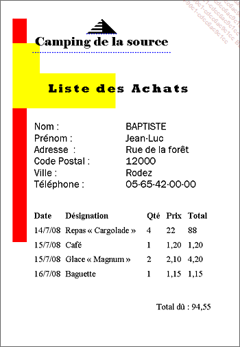

Cas pratique
Monique, sa fille Rachel et son gendre Marc gèrent un camping dans les Pyrénées orientales. Le camping est ouvert du 1er juin au 30 septembre. Ils disposent de cinquante emplacements sur un terrain d’une superficie totale de quarante hectares.

Ils sont équipés d’un logiciel spécialisé dans la réservation des emplacements qui fonctionne très bien mais qui ne permet pas de gérer les achats de l’épicerie ou du bar selon leurs règles de gestion. En effet, les vacanciers ne payent leurs achats qu’à la fin de leur séjour. Concrètement, les achats sont inscrits manuellement sur une fiche bristol créée pour chaque famille de vacanciers. À la fin du séjour, les cumuls sont réalisés et une facture manuelle concernant les achats est établie. Les propriétaires du camping souhaiteraient disposer d’un logiciel permettant d’automatiser la création de la facture grâce à la saisie journalière des achats.

Voici une représentation de la fiche bristol :

