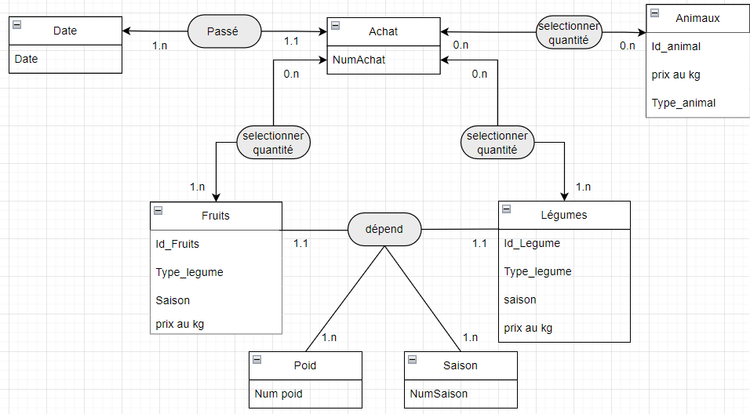
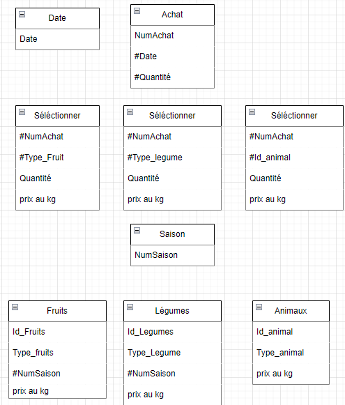

# Premier exercice

## Énoncé

Un agriculteur, Monsieur Bousquet, fait de la vente directe de ses produits ou animaux qu’il élève. Il vend des lapins, des poules, des dindes, des veaux, des cochons. Selon la saison il vend aussi des légumes (choux, pommes de terre, carottes...) et des fruits (fraises, poires, pommes...). Il ne fait que de la vente directe. À la suite de votre discussion, il ressort les informations suivantes.

À l’heure actuelle, les ventes sont inscrites sur trois cahiers distincts :

- Un pour les animaux.

- Un pour les fruits.

- Un pour les légumes.

Tout est vendu au kilo, les animaux sont pesés vivants avant d’être vendus.

Il souhaiterait un logiciel simple pour saisir les ventes journalières et pouvoir éditer un récapitu-latif mensuel par type de vente (animaux, légumes et fruits) et par produit (poulets, lapins, poireaux, poires...) pour sa comptabilité.

Travail à faire:

- Créer le Modèle Conceptuel des Données.

- Concevoir le Modèle Logique des Données.

- Finir par le Modèle Physique des Données.

## Réponse
### MCD

### MLD

### MPD
Date (Date)
Achat (NumAchat, #Date, #Quantité)
Séléctionner (#NumAchat, #Type_Fruit, Quantité, prix au kg)
Séléctionner (#NumAchat, #Type_legume, Quantité, prix au kg)
Séléctionner (#NumAchat, #Id_animal, Quantité, prix au kg)
Saison (NumSaison)
Fruits (Id_Fruits, Type_fruits, #NumSaison, prix au kg)
Légumes (Id_Legumes, Type_Legume, #NumSaison, prix au kg)
Animaux (Id_animal, Type_animal, prix au kg)