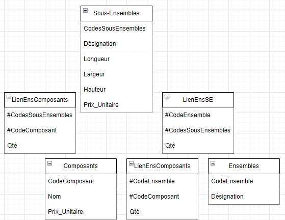
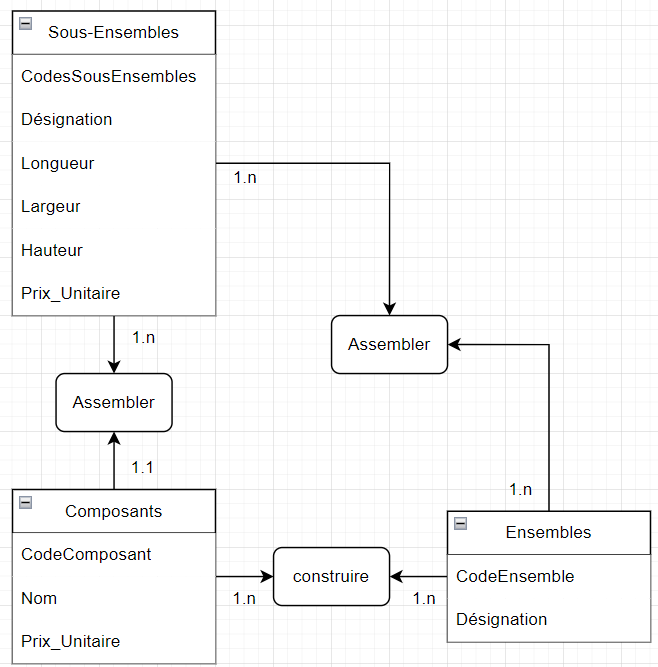

# MLD

# MCD

# Dictionnaire de Données
| Nom                 | Format        | Longueur | Type | Document |
| :------------------ |:------------- | :------: |:----:| :------: |
| Ensembles           | Alphabetique  |
| CodeEnsemble        | Numerique     |
| Désignation         | Alphabetique  |
|
| Composants          | Alphabetique  |
| CodeComposant       | Numerique     |
| Nom                 | Alphabetique  |
| Prix_Unitaire       | Numerique     |
|
| Sous-Ensembles      | Alphabetique  |
| CodesSousEnsembles  | Numerique     |
| Désignation         | Alphabetique  |
| Longueur            | Numerique     |
| Hauteur             | Numerique     |
| Prix_Unitaire       | Numerique     |
