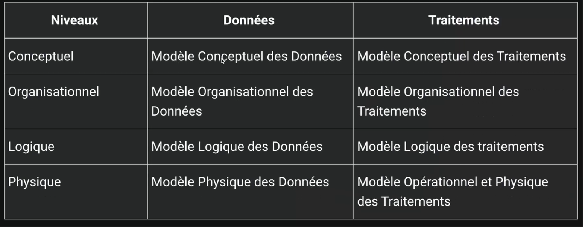
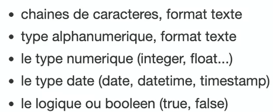

# recueil d'info

## etude des docu interne

## etude des docu externe

# types d'info

## info elementaire

l'info doit etre atomique

 '34, rue de la paix, 75000 Paris'

 3 info elementaires:
 - adressse    => 34, rue de la paix
 - code postal => 75000
 - ville       => Paris

 une valeur prise par une info est une occurence (une donnée)

 ## approche nivelée 
 4 niveaux de Merise pour effectuer la conception d'un SI

 - niveau conseptuel
 - niveau organisationnel
 - niveau logique
 - niveau physique

suite a la collecte des doccument on peut y remplir un dictionnaire de données 

dictionnaire de données

1 Dependances fonctionnelles:
est une relation entre deux attributs d'une table. 
A dépend fonctionnellement d'une donnée B

Pour formaliser une dependance fonctionnelle on utilise la notation suivante :   
Numero adherent (Nom, prenom, code postal, ville, telephone, date d'adhesion, mail)

La partie gauche (numero adherent) est la source de la dependance fonctionnelle. La partie droite desgine le but de la dependance.

2 Dependances fonctionnelles composées

Si une dependance fonctionnelle fait intervenir plus de deux attributs (source) on parle de dependance fonctionnelle composee.  
Exemple: Pour connaitre le temps d'un coureur sur une etape donnee il nous faut son numero ou son nom ainsi que le nom ou le numero de l'etape.          
Formalisation:  
(numero coureur, numero etape) (temps)